# The Definitive DOOM [2/40 maps, MBF21, Ultimate DOOM]

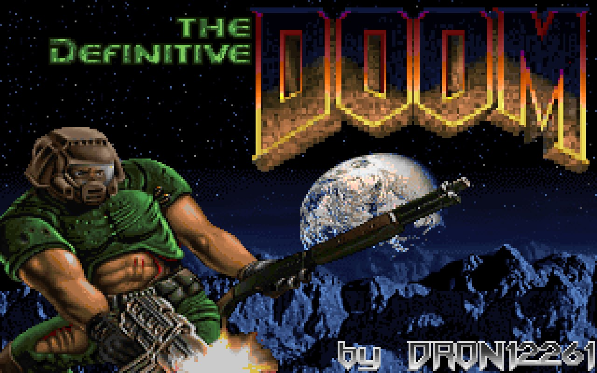

It's a remake/re-imagination of Ultimate Doom with the goal of fixing many of its flaws, reworking and expanding the maps to a new look with a much higher quality of design, as well as adding some narrative to the levels.

# STATUS: 📦EARLY RELEASE

### Download - [Latest Release](https://github.com/dron12261games/WAD-Definitive-Doom/releases/download/v0.1/DEFDOOM.v0.1.zip)

## MapList:
- `E1M10` - Lair Under Base ```✅DONE``` (map in reserve, needs a little refining)
- `E2M10` - Tech Gone Mad ```✅DONE``` (map in reserve, needs a little refining)
- `E3M1` - Infernal Prison ```🏁WORK IN PROGRESS```
- `E3M9` - Awakened and Enraged ```🏁WORK IN PROGRESS```
- `E4M1` - Above Hell ```✅DONE```
- `E4M2` - Ultimate Anger ```✅DONE```

# Comparison:
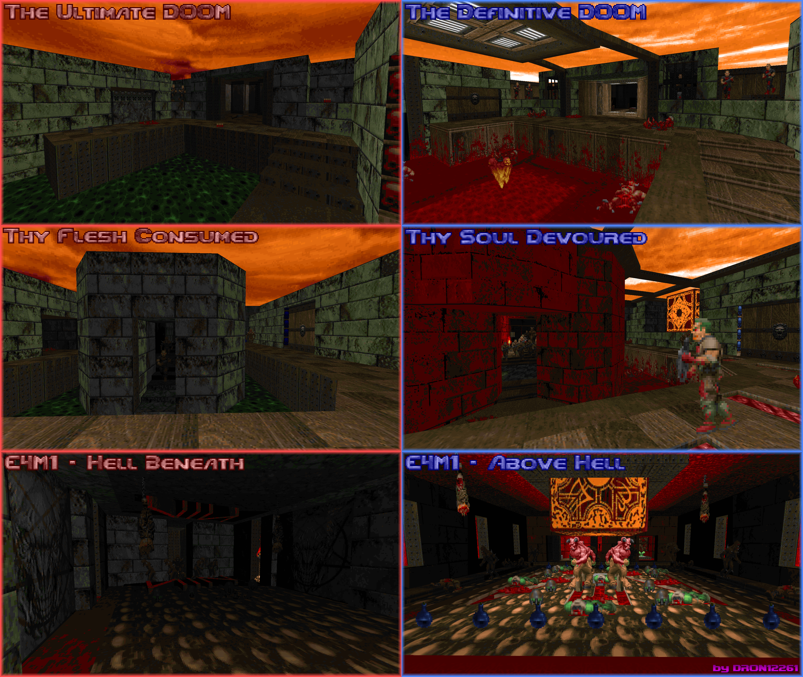


# Screenshots:

## E3M1: Infernal Prison
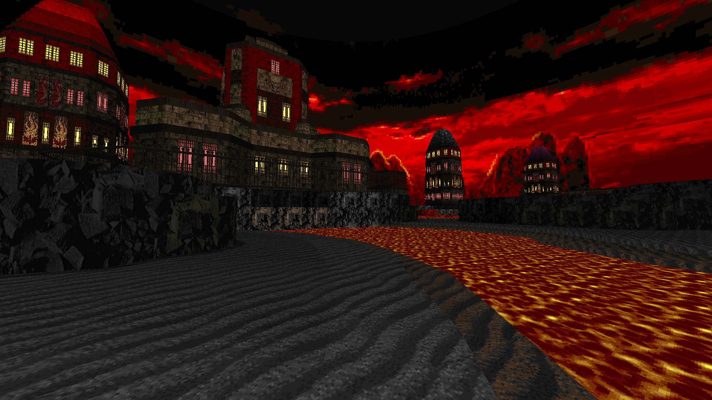

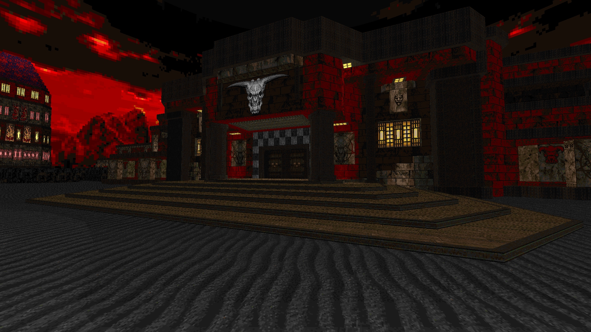
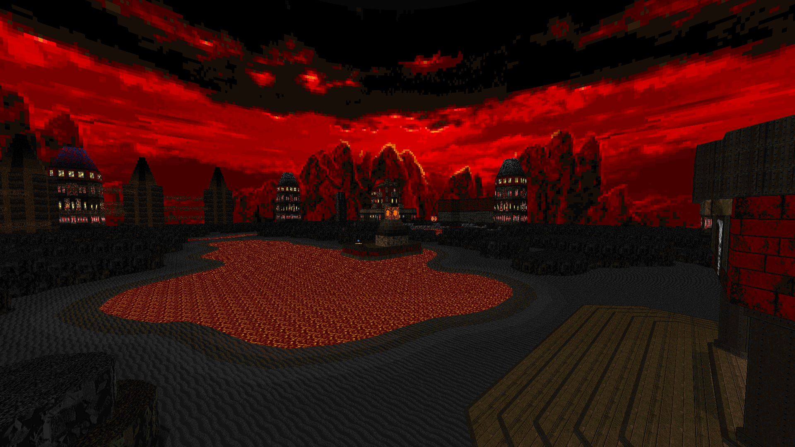

## E4M1: Above Hell
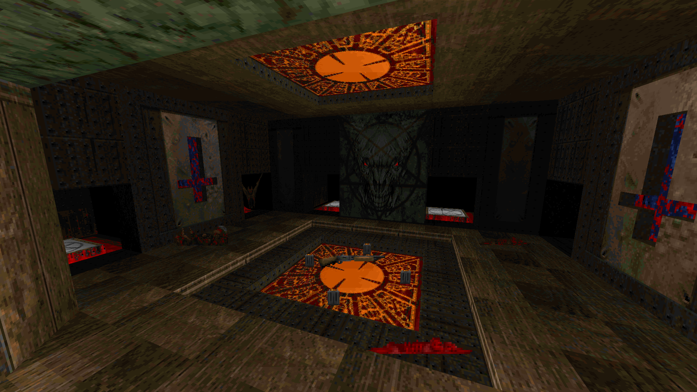
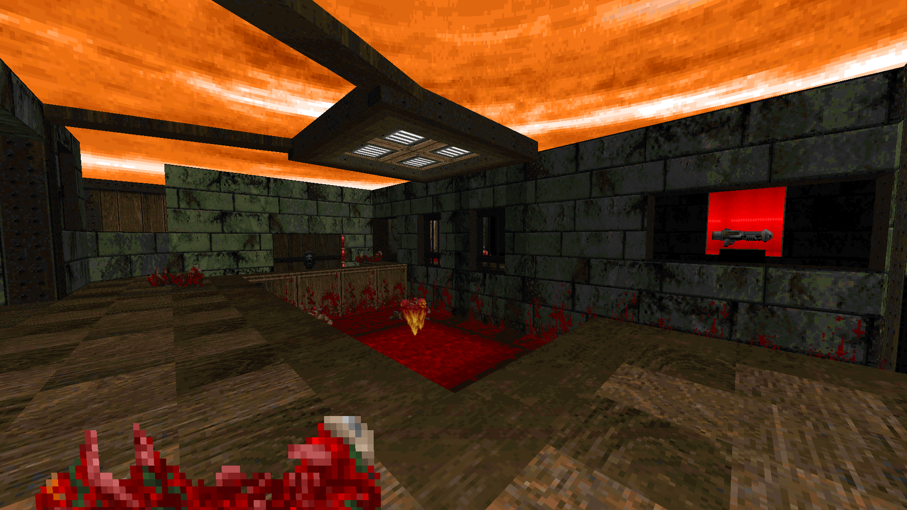

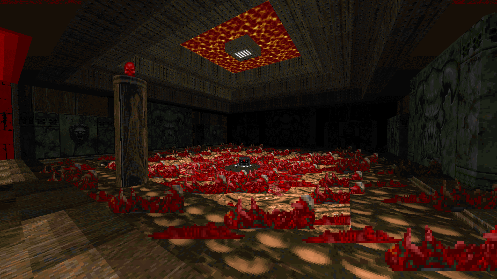
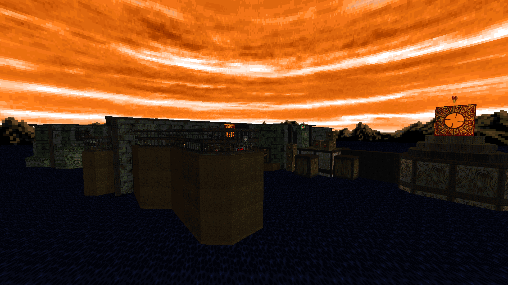

## E4M2: Ultimate Anger
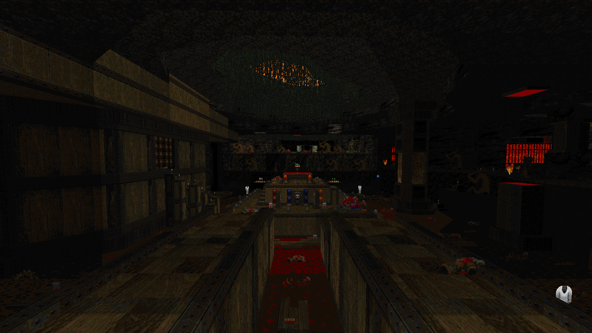
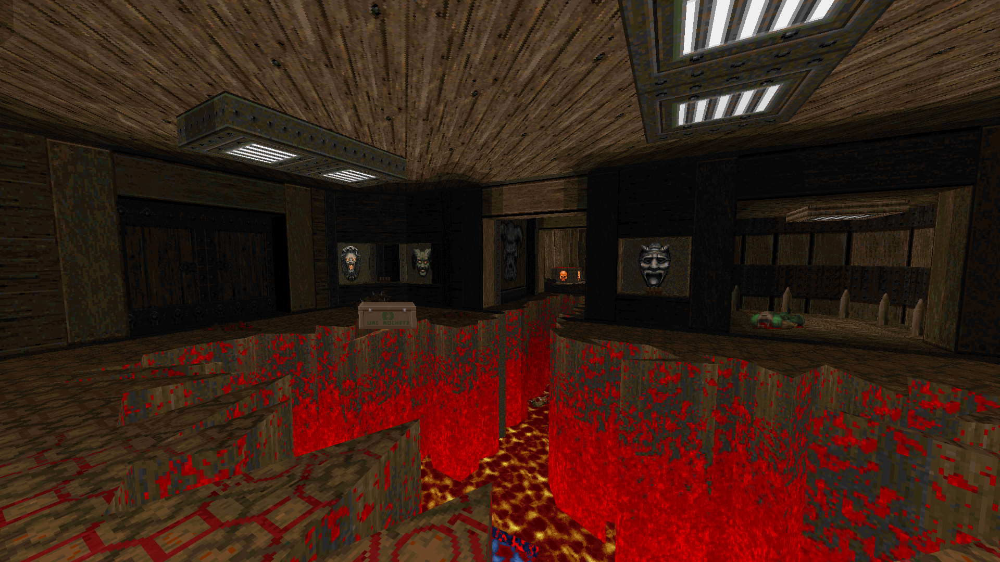
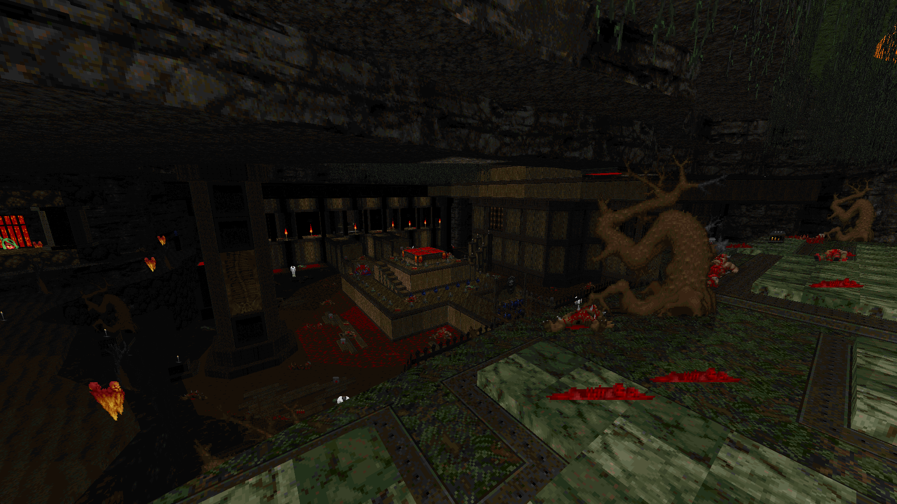
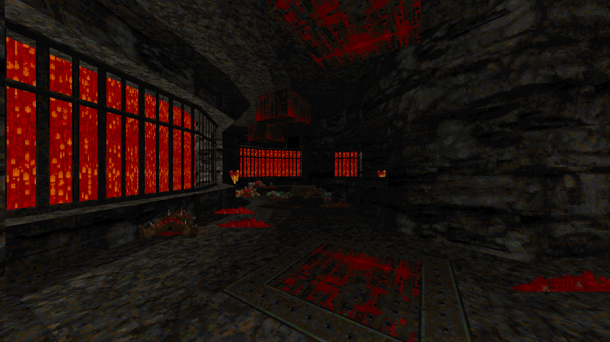
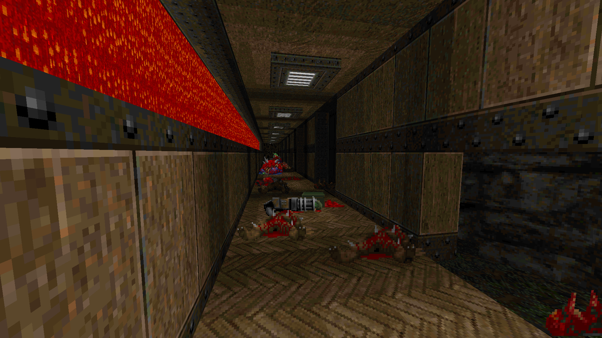
